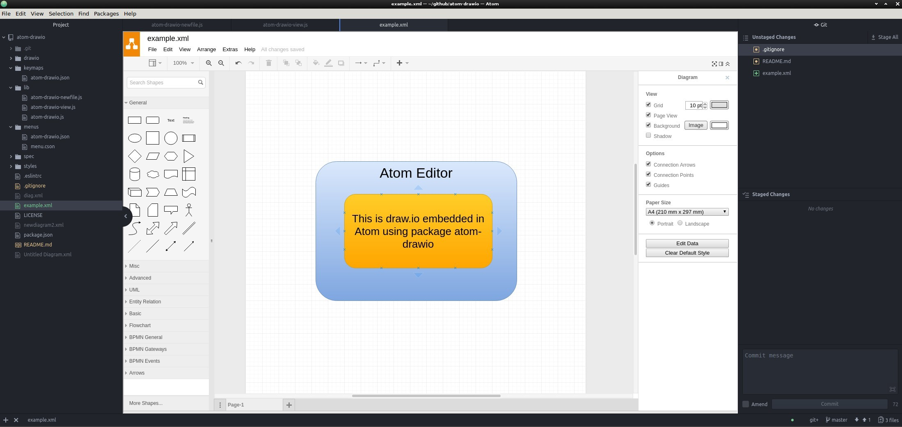

# Package to provide embedded Draw.io diagram editting support in Atom

Create and edit your draw.io diagrams directly from within the Atom editor.

This is an early release - please feel free to contribute and improve this
package.

Note:
Ideally, draw.io (mxfiles) should be able to be rendered when referenced
from Markdown files as images.  Also, support needed to render in Github markdown
and gh-pages/jekyll.

For now use either the 'Export to PNG' button or 'File->Embed->Image' option
to allow for easy embedding of diagrams in Markdown files.

## Screenshot

Enjoy :-)

## License

The atom-drawio project is released under the [MIT License](LICENSE).

Draw.io itself is released by jpgraph under the [Apache-2.0 License](https://github.com/jgraph/drawio/blob/master/LICENSE)

## Developer Notes

### Git Subtree Draw.io repo
Note: Change branch names below as appropriate - update here for reference.

#### Add subtree
```bash
git subtree add --prefix drawio https://github.com/gbevan/drawio.git D20180402_support_atom --squash
```

#### Pull subtree
```bash
git subtree pull --prefix drawio https://github.com/gbevan/drawio.git D20180402_support_atom --squash
```

#### Prepare clone for pushing to drawio fork
```bash
git remote add gbevan-drawio git@github.com:gbevan/drawio.git
```

#### Get diff of subtree against remote branch
```bash
cd drawio
git diff-tree -r --name-status gbevan-drawio/D20180402_support_atom
837953b034d80c38b0f428f2cffffef449441718
M	src/main/webapp/cache.manifest
M	src/main/webapp/js/app.min.js
M	src/main/webapp/js/viewer.min.js
```
This still reports changes even after the push to the subtree remote.
Found this discussion - https://github.com/progit/progit2/issues/571
```bash
git diff-tree -r --name-status HEAD:drawio/ gbevan-drawio/D20180402_support_atom
```
(changes must have been committed)
TODO: further testing needed of this above.

#### Push subtree to fork
To push changes back to the subtree fork:
```bash
git subtree push --prefix drawio gbevan-drawio D20180402_support_atom
```
and raise pull requests against the upstream repo as needed.

### Prepare Build
```bash
npm run-script build
```
This prepares the drawio build by running `ant all` in `drawio/etc/build` -
this the `*.min.js` files for drawio.

### Test Locally
```bash
apm link
```
links the local clone to Atom for testing, prior to release.

### Release to Atom
```bash
# for a patch release
apm publish patch

# for a minor release
apm publish minor

# for a major release
apm publish major
```
